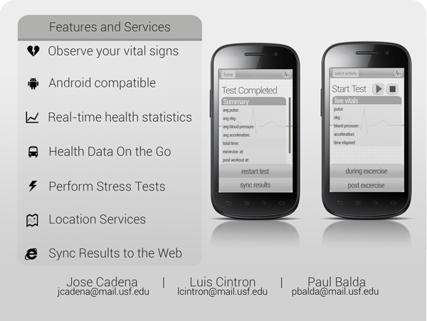

# SmartVitals
Mobile Application and Web Service for Health Sensor Data Collection, Visualizatoin, and Reporting - Developed in 2012 as the final project for the Mobile Development course at the University of South Florida. Credits to: Jose Cadena, Paul Bada, Luis Cintron

